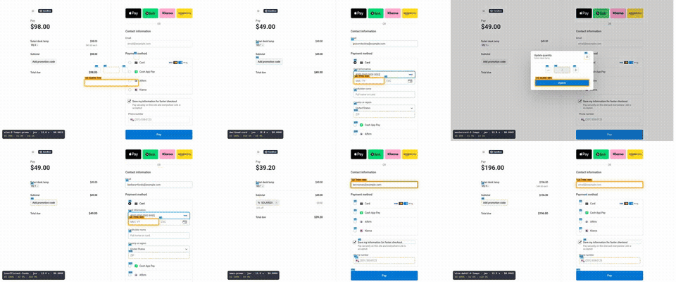
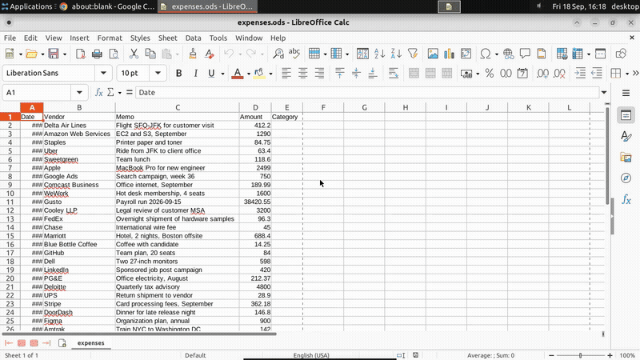

# solari-fast-showcase

Long, real workflows on [Solari](https://getsolari.com) browsers and desktops, done two ways and verified independently:

- **solari-reflex:** reads the screen as numbered controls, has [Jev](https://docs.typesafe.ai) choose each step, and verifies every action. See [hitakshiA/solari-reflex](https://github.com/hitakshiA/solari-reflex).
- **The stock loop:** Codex CLI with GPT-6 Astra, driving Solari through Solari's own MCP server ([`@solarisdk/mcp`](https://www.npmjs.com/package/@solarisdk/mcp)). The same Codex is also run against our fork, [hitakshiA/solari-mcp](https://github.com/hitakshiA/solari-mcp).

Every lane is judged by the app it worked in (Stripe's API, the saved spreadsheet, the database), never by what the agent says. Every lane is recorded with an overlay showing what the agent saw and chose.

> Work in progress. Results and videos are added as each workflow lands.

## Workflows

| Workflow | Surface | Real app | Verified by |
|---|---|---|---|
| [`stripe-checkout`](workflows/stripe-checkout.ts) | Browser (N lanes) | Stripe Checkout, test mode | Stripe API: a paid Checkout Session with the right quantity and discount, or a declined PaymentIntent, per buyer |
| [`calc-expenses`](workflows/calc-expenses.ts) | Desktop | LibreOffice Calc | The saved `.ods`, converted by a separate LibreOffice instance and compared with an answer key the agent never sees |

Each workflow has a Codex arm (`*-codex.ts`) that gives the same task to the Codex CLI and checks it the same way.

## Results so far

Everything below was driven from Bengaluru against Solari's us-west region, on 2026-09-18.

### `stripe-checkout`: 6 buyers in parallel on real Stripe Checkout (test mode)



[Full video (MP4)](media/stripe-6-lanes.mp4). Each lane is its own Solari browser. Blue boxes are the numbered controls Jev was offered. Amber is its pick with its confidence. Dashed boxes are the runners-up. The bar at the bottom shows the lane, the elapsed time, the spend and the top probabilities.

| Lane | Scenario | Stripe says | Steps (by Jev) | Time | Model cost |
|---|---|---|---|---|---|
| visa-2-lamps-promo | quantity 2, code SOLARI20, Visa | paid $78.40 | 17 (15) | 60.2 s | $0.011 |
| declined-card | `4000…0002` | declined | 11 (10) | 40.3 s | $0.009 |
| mastercard-3-lamps | quantity 3, Mastercard | paid $147.00 | 14 (12) | 50.6 s | $0.013 |
| insufficient-funds | `4000…9995` | declined | 11 (10) | 41.3 s | $0.009 |
| amex-promo | code SOLARI20, Amex | paid $39.20 | 14 (13) | 47.3 s | $0.010 |
| visa-debit-4-lamps | quantity 4, Visa debit | paid $196.00 | 14 (12) | 48.1 s | $0.013 |

- **6 of 6 lanes verified by Stripe's API.** A "paid" lane counts only when Stripe's amounts match the order: the quantity, and the 20% discount where the code was asked for.
- **66 s wall clock** for all six.
- **72 of 81 steps decided by Jev.** The Advisor made the other 9, when Jev's confidence was below 0.6.
- **$0.064 of model spend** in total.

**The same checkout run by Codex.** This is the Codex CLI with GPT-6 Astra (ChatGPT sign-in, medium reasoning) on visa-2-lamps-promo, the longest scenario. Stripe checked it the same way.

| Agent | Stripe says | Time | Tool calls | Input tokens |
|---|---|---|---|---|
| solari-reflex + Jev | paid $78.40 | **60.2 s** | 17 actions | 0.08 M to Jev, plus 1 planner, 2 Advisor and 8 writer calls: $0.011 in all |
| Codex + Solari's MCP ([`@solarisdk/mcp`](https://www.npmjs.com/package/@solarisdk/mcp) 0.5.0) | paid $78.40 | 194.9 s | 34 | 0.67 M |
| Codex + our MCP fork ([hitakshiA/solari-mcp](https://github.com/hitakshiA/solari-mcp)) | paid $78.40 | 135.5 s | 26 | 0.57 M |

### `calc-expenses`: 30 card transactions categorised in LibreOffice Calc, on a Solari desktop



[Full video (MP4)](media/calc-expenses.mp4). The screen was recorded inside the desktop, and the overlay was burned in afterwards by solari-reflex's `DesktopRecorder`.

The sheet holds 30 card transactions (date, vendor, memo, amount) and an empty Category column. Each row must get one of 12 accounts. Every arm works only through Calc's UI and saves with Ctrl+S. The file is then checked against the answer key.

| Agent | Correct | Time | Tool calls | Model cost |
|---|---|---|---|---|
| solari-reflex + Jev | **30/30** | **24.2 s** | 4 observations, 31 actions | $0.0008 (30 Jev calls) |
| Codex + Solari's MCP (screenshots, clicks, keys) | 30/30 | 98.4 s | 77 | 0.24 M input tokens |
| Codex + our MCP fork | 30/30 | 132.1 s | 80 | 0.56 M input tokens |

How the Jev arm works:

1. Read the rows that are on screen from the accessibility tree.
2. Ask Jev one choice per row, all at the same time: 25 decisions come back in about 1.4 s.
3. Write each answer into its cell.
4. Jump with the Name Box to bring the remaining rows into view, and repeat.

An earlier version asked about one row at a time and took 91.5 s, level with Codex. The speed comes from Jev decisions being cheap and independent enough to ask all at once.

Two things this run showed:

- **Codex was quick here.** A frontier model reads the whole visible sheet from one screenshot, then types answers blind (type a category, press Enter, repeat) with few screenshots in between. This task has few state changes to wait for, so the gap is smaller than on Stripe.
- **Our MCP fork slowed Codex down on this task.** It sends the text tree instead of screenshots, and a spreadsheet's tree is large. That doubled the input tokens.

## Limits we hit

- **Concurrent desktops.** Our Solari account holds two sandboxes or desktops at a time; a third gets `429 ConcurrencyLimitExceeded`. Browser sessions are counted separately (the six Stripe lanes ran together). Running 10 desktops at once needs a higher limit.
- **Calc cell positions.** LibreOffice reports sheet cells about 25 px above where it draws them; its other controls are placed correctly. solari-reflex focuses cells through the accessibility API instead of clicking them, so input is unaffected. The overlay applies the offset when drawing.

## Run

Clone this repo next to [solari-reflex](https://github.com/hitakshiA/solari-reflex) and build that first (`npm install && npm run build`), then:

```bash
npm install
cat > .env <<'KEYS'
SOLARI_API_KEY=slr_live_...
OPENROUTER_API_KEY=sk-or-...          # Jev (TypeSafe on OpenRouter), the planner, the text writer
STRIPE_TEST_SECRET_KEY=sk_test_...    # test mode only; the script refuses a live key
KEYS
node --env-file=.env workflows/stripe-checkout.ts 6               # six lanes in parallel
node --env-file=.env workflows/calc-expenses.ts 30                # one desktop, recorded
node --env-file=.env workflows/stripe-checkout-codex.ts stock 0   # Codex on scenario 0 (stock | fast MCP)
node --env-file=.env workflows/calc-expenses-codex.ts stock 30    # Codex on the Calc sheet
```

The Codex arms (`lib/codex-arm.ts`) need the Codex CLI signed in with ChatGPT, plus `npm install` in `codex/` for the stock MCP server. Codex runs headless with only Solari's MCP server loaded and its own shell sandbox set to read-only. On the desktop task, any call to a shell or file tool marks the run as breaking the rules. Recording a desktop needs `ffmpeg`, plus `rsvg-convert` or ImageMagick, on the machine running the workflow.
